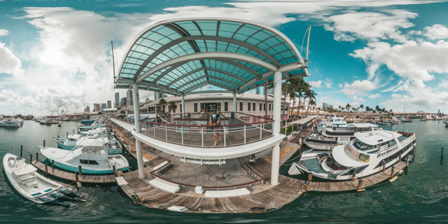
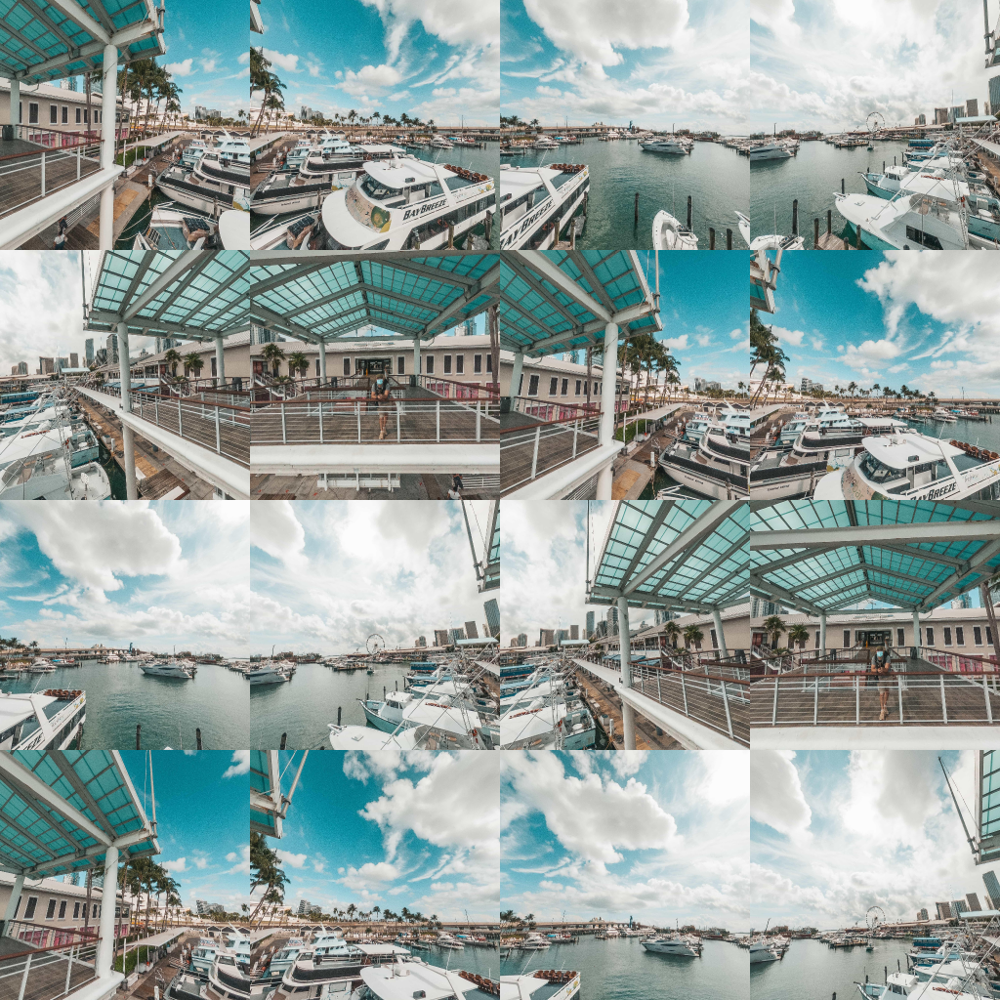

# equirectangular_to_multi_perspective_generator
## Description
The code in this repository generates multiple perspective images from a single equirectangular image with a slightly different viewing direction.

**Input**


**Outputs**



## Installation
Develop environment can be installed by:
```
make install_poetry
poetry install
```

I have also prepared `requirements.txt`,
so if you would like to use it, run the following command:
```
pip install -r requirements.txt
```

## Usage
```
make main
```
or
```
poetry run python src/main.py
```
or
```
python src/main.py
```

## Configulation


## Motivations
When equirectangular images taken with a omnidirectional camera are used for technologies developed from perspective images, such as object detection, super-resolution and 3D reconstruction, it is common to use cube mapping.
However, cube mapping method is susceptible to image 'cuts' that occur at the edges of the cube.
If the issues of computational cost and time can be ignored, the author believe that the method of generating perspective images for various orientations generated from the code in this repository can to some extent address the ‘cuts’ at the edges of the cube.

## References
- https://github.com/sunset1995/py360convert